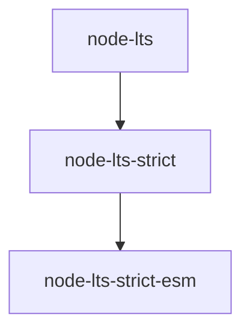

# @valtech-commerce/tsconfig

[![npm][npm-badge]][npm-url]
[![npms.io: Score][npmsio-badge]][npmsio-url]
[![libraries.io: SourceRank][librariesio-badge]][librariesio-url]
[![Tests][tests-badge]][tests-url]
[![License: MIT][license-badge]][license-url]

> Opinionated TSConfig [base configs](https://www.typescriptlang.org/tsconfig#extends).

## Base configs

| Base config                                            | Description                                            |
| ------------------------------------------------------ | ------------------------------------------------------ |
| [node-lts](config/node/lts.yaml)                       | Node.js LTS version                                    |
| [node-lts-strict](config/node/lts-strict.yaml)         | Node.js LTS version, strict rules                      |
| [node-lts-strict-esm](config/node/lts-strict-esm.yaml) | Node.js LTS version, strict rules with ESM compilation |

### Dependency tree



## Install

```
$ npm install @valtech-commerce/tsconfig
```

## Usage

Add configuration base to your `tsconfig.json`:

```json
{
	"extends": "@valtech-commerce/tsconfig/base/[BASE_CONFIG]"
}
```

## Specifications

### `node-lts`

#### Used configuration

- [@tsconfig/node-lts](https://www.npmjs.com/package/@tsconfig/node-lts) - Base configuration for the current LTS version of Node.js

#### Extra

- Enables [sourceMap](https://www.typescriptlang.org/tsconfig#sourceMap) by default
- Configures [tsconfig-paths](https://www.npmjs.com/package/tsconfig-paths) for [ts-node](https://www.npmjs.com/package/ts-node)

### `node-lts-strict`

#### Used configuration

- [@tsconfig/node-lts-strictest](https://www.npmjs.com/package/@tsconfig/node-lts-strictest) - Base configuration for the current LTS version of Node.js with strict rules

#### Extra

- Disables some rules by default

### `node-lts-strict-esm`

#### Used configuration

- [@tsconfig/node-lts-strictest-esm](https://www.npmjs.com/package/@tsconfig/node-lts-strictest-esm) - Base configuration for the current LTS version of Node.js with strict rules + compiles to ESM

## Documentation

See the [Changelog](CHANGELOG.md) to see what has changed.

## Contribute

See the [Contributing Guidelines](CONTRIBUTING.md) for ways to get started.

See the [Support Guide](SUPPORT.md) for ways to get help.

See the [Security Policy](SECURITY.md) for sharing vulnerability reports.

This project has a [Code of Conduct](CODE_OF_CONDUCT.md).
By interacting with this repository, organization, or community you agree to abide by its terms.

## License

[MIT](LICENSE) © [Valtech Canada inc.](https://www.valtech.ca/)

[npm-badge]: https://img.shields.io/npm/v/@valtech-commerce/tsconfig?style=flat-square
[npmsio-badge]: https://img.shields.io/npms-io/final-score/@valtech-commerce/tsconfig?style=flat-square
[librariesio-badge]: https://img.shields.io/librariesio/sourcerank/npm/@valtech-commerce/tsconfig?style=flat-square
[tests-badge]: https://img.shields.io/github/actions/workflow/status/valtech-commerce/tsconfig/tests.yaml?style=flat-square&branch=main
[license-badge]: https://img.shields.io/badge/license-MIT-green?style=flat-square
[npm-url]: https://www.npmjs.com/package/@valtech-commerce/tsconfig
[npmsio-url]: https://npms.io/search?q=%40valtech-commerce%2Ftsconfig
[librariesio-url]: https://libraries.io/npm/@valtech-commerce%2Ftsconfig
[tests-url]: https://github.com/valtech-commerce/tsconfig/actions/workflows/tests.yaml?query=branch%3Amain
[license-url]: https://opensource.org/licenses/MIT
